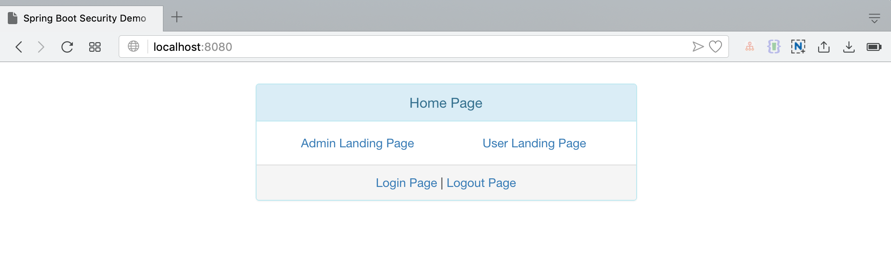
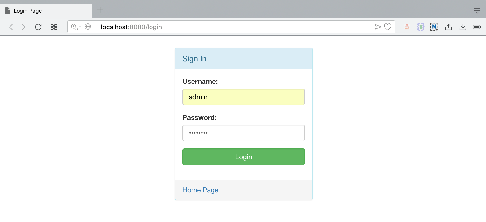
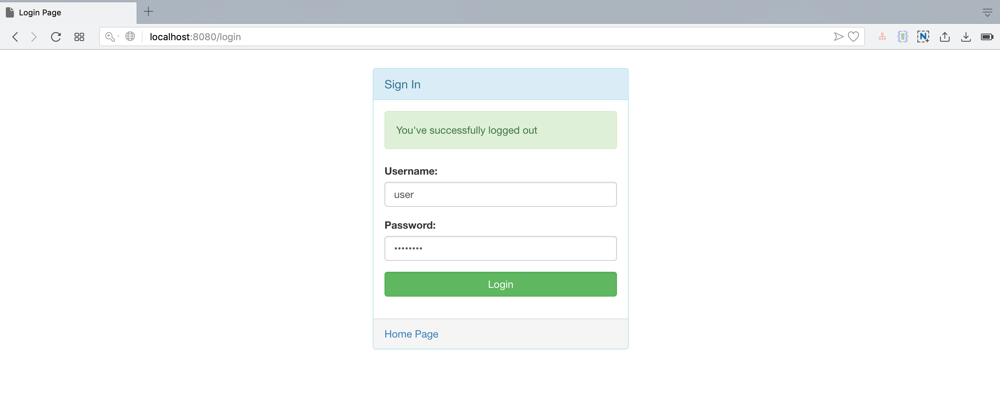
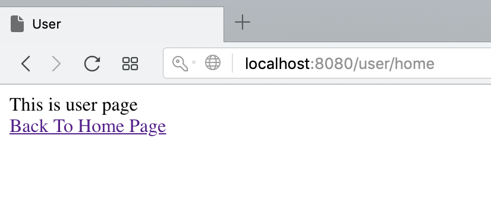
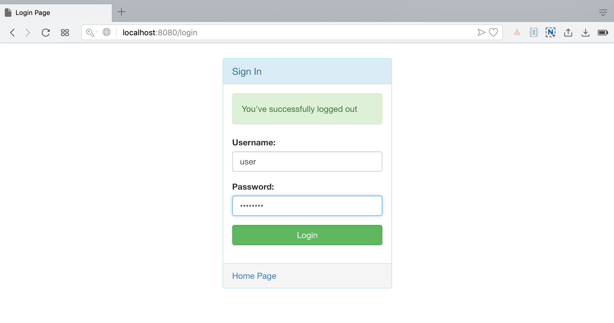

# spring-security-spring-boot-mysql

Run this project by run this command :

`mvn clean spring-boot:run`

### User Login

|#|Username|Password|
|---|---|---|
|1|admin|password|
|2|user|password|

### Screenshot

Home Page

Admin Login Page

Admin Landing Page

User Login Page

User Landing Page

User Logout Page

